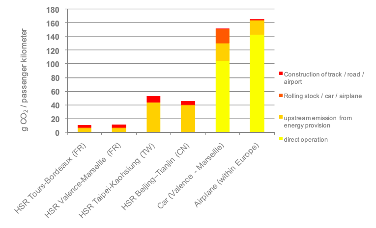

# Executive Public Summary for "Tackling Climate Change with High-Speed Rail"

Arnica Khaton, Dhara Parsania, Payal Yadav and Daniel Yassa  
November 17, 2024  
ISCI 3A12 Climate Change  

## Introduction & Justification 
Concerns regarding the impact of fossil-fuel based transportation on climate change have been rapidly increasing (Y. Lin et al. 2021). High-speed rail (HSR) has emerged as a method of low-emissions passenger transport that can play a role in the decarbonization of the transportation sector in the Toronto-Quebec City corridor (Balakrishnan, Zhu, and Wallis 2018).  

## Brief History of HSR 
Japan pioneered the development of high-speed rail in 1964, and since then, over 20 countries worldwide have established their own HSR infrastructure (Shen, Pan, and Feng 2023; International Union of Railways 2016). HSR encompasses a variety of technologies including magnetic levitation and steel tracks which are more commonly used as they effectively reduce friction and resistance (Shen, Pan, and Feng 2023).

## HSR as a Climate Change Solution 
Regions that primarily rely on renewable energy sources benefit significantly more, in-terms of environmental sustainability, from HSR as it requires electricity (Binti Sa’adin, Kaewunruen, and Jaroszweski 2016). HSR reduces carbon monoxide levels and also has fewer GHG emissions compared to buses, cars and airplanes which emit 8, 12, and 19 times more greenhouse gases (GHG) respectively (Guo et al. 2020; Sun and Lin 2018). Canada is an ideal candidate for HSR and the implementation can benefit the Canadian economy, reduce congestion, provide intercity connectivity and help mitigate climate change (Manmohan and Saxena 2023; S. Lin et al. 2024). 

## Case Studies
France has been a leader in developing high-speed rail in Europe and offers a valuable contrast to China, with differences in energy production, social structure, and its focus on connecting only major cities. GHG emissions in China were reduced by only 1.33% due to its dependence on coal for electricity generation (Y. Lin et al. 2021). Meanwhile the HSR system in France saw a larger decrease in GHG emissions as it is powered primarily by nuclear energy (Figure 1) (Y. Lin et al. 2021). Additionally, France developed the HSR system between high-density cities which reduced the GHG emissions per passenger (Barbosa 2018). In both France and China, HSR reduced reliance on unsustainable air travel, decreased travel time, and boosted the economy by connecting cities (Zhang, Wan, and Yang 2019; Boto-García and Pérez 2023; Lawrence, Bullock, and Ziming 2019)

*Figure 1: GHG emissions associated with HSR, cars, and airplanes, spanning from the construction phase through to the operational phase. Both cars and airplanes emit significantly more CO2 than any form of HSR. Even though the Chinese high-speed rail network relies on coal-powered electricity, it still produces fewer CO2 emissions compared to cars and airplanes (International Union of Railways 2011). This data varies depending on the electricity source, load factor and amount of trains using HSR.*

## Feasibility in Canada 
The Canadian HSR application is promising especially between the Toronto and Quebec City Corridor due to population density and an optimal distance range between the cities (Tasker-Brown and Patterson 2014). It would also increase social and economic productivity as well as tourism, while reducing traffic and air travel (Balakrishnan, Zhu, and Wallis 2018; Manmohan and Saxena 2023). The energy supply of Ontario and Quebec is substantially renewable in nature, reducing the operational carbon dioxide emissions from the electricity supply (Canada Energy Regulator 2024).

## Limitations and Drawbacks
The limitations of HSR span a large financial barrier to implementation with a high capital cost but feasible operational costs with expansive benefits (Nash 2015). Carbon emissions are hidden in the steel production used to make rails and the makeup of the electricity source (with non-renewable sources adding to GHG emissions) (Kaizuka 2021).  

## Areas for Further Research
Further studies are needed on the life cycle assessments at the stages of development, improving efficiency, and understanding the socio-political implications such as the labour legislation or regional accessibility that influence the acceptance of HSR (Mao et al. 2023; Yaghoubi 2013; Momenitabar et al. 2021). 

## Conclusion 
HSR presents a promising solution for mitigating climate change in Canada. By understanding the social and political implications of HSR and using key insights from HSR systems in France and China, Canada can invest in a system that is both environmentally and economically friendly and move towards a more sustainable future.  

## References 
Balakrishnan, Jaydeep, Tianyuan Zhu, and Peter Wallis. 2018. High Speed Rail in Canada: Feasibility Studies, Influential Factors and International Comparisons. IGI Global Scientific Publishing. https://www-igi-global-com.libaccess.lib.mcmaster.ca/chapter/high-speed-rail-in-canada/197169.  
Barbosa, Fábio C. 2018. “High Speed Rail Technology: Increased Mobility With Efficient Capacity Allocation and Improved Environmental Performance.” In 2018 Joint Rail Conference, V001T04A002. Pittsburgh, Pennsylvania, USA: American Society of Mechanical Engineers. https://doi.org/10.1115/JRC2018-6137.  
Binti Sa’adin, Sazrul Leena, Sakdirat Kaewunruen, and David Jaroszweski. 2016. “Risks of Climate Change with Respect to the Singapore-Malaysia High Speed Rail System.” Climate 4 (4): 65. https://doi.org/10.3390/cli4040065.  
Boto-García, David, and Levi Pérez. 2023. “The Effect of High-Speed Rail Connectivity and Accessibility on Tourism Seasonality.” Journal of Transport Geography 107 (February):103546. https://doi.org/10.1016/j.jtrangeo.2023.103546.  
Canada Energy Regulator. 2024. “CER – Provincial and Territorial Energy Profiles – Ontario.” September 10, 2024. https://www.cer-rec.gc.ca/en/data-analysis/energy-markets/provincial-territorial-energy-profiles/provincial-territorial-energy-profiles-ontario.html#.  
Guo, Xiaoyang, Weizeng Sun, Shuyang Yao, and Siqi Zheng. 2020. “Does High-Speed Railway Reduce Air Pollution along Highways? —— Evidence from China.” Transportation Research Part D: Transport and Environment 89 (December):102607. https://doi.org/10.1016/j.trd.2020.102607.  
International Union of Railways. 2011. “Carbon Footprint of High Speed Rail.” Paris, France. https://railroads.dot.gov/sites/fra.dot.gov/files/fra_net/15009/Carbon%20Footprint%20of%20High-Speed%20Rail%20UIC%202011.pdf.   “High-Speed Data and Atlas.” November 2, 2016. https://uic.org/passenger/highspeed/article/high-speed-data-and-atlas.   
Kaizuka, James. 2021. “Even Electric Trains Use Coal: Fixed and Relative Costs, Hidden Factors and Income Inequality in HSR Projects with Reference to Vietnam’s North–South Express Railway.” Sustainability 13 (24): 13563. https://doi.org/10.3390/su132413563.   
Lawrence, Martha, Richard Bullock, and Liu Ziming. 2019. China’s High-Speed Rail Development. International Development in Focus. Washington, DC: World Bank. https://hdl.handle.net/10986/31801.  
Lin, Siyi, Chia-Lin Chen, Xiaohan Yu, Hyungchul Chung, and Roger Vickerman. 2024. “A Holistic Motility Understanding of the Social Phenomena Underlying Inter-City High-Speed Rail Commuting: Evidence from China’s Yangtze River Delta.” Case Studies on Transport Policy 15 (March):101131. https://doi.org/10.1016/j.cstp.2023.101131.  
Lin, Yatang, Yu Qin, Jing Wu, and Mandi Xu. 2021. “Impact of High-Speed Rail on Road Traffic and Greenhouse Gas Emissions.” Nature Climate Change 11 (11): 952–57. https://doi.org/10.1038/s41558-021-01190-8.  
Manmohan, Atul, and Kshitij Saxena. 2023. “A Multi-Criteria Analysis of High Speed Rail System in Canada.” In 2023 IEEE Vehicle Power and Propulsion Conference (VPPC), 1–6. https://doi.org/10.1109/VPPC60535.2023.10403224.  
Mao, Ruichang, Yankun Wu, Jian Chen, Peng Chen, and Xiaodong Li. 2023. “Development Patterns, Material Metabolism, and Greenhouse Gas Emissions of High-Speed Railway in China.” Communications Earth & Environment 4 (1): 1–10. https://doi.org/10.1038/s43247-023-00972-6.  
Momenitabar, Mohsen, Raj Bridgelall, Zhila Dehdari Ebrahimi, and Mohammad Arani. 2021. “Literature Review of Socioeconomic and Environmental Impacts of High-Speed Rail in the World.” Sustainability 13 (21): 12231. https://doi.org/10.3390/su132112231.  
Nash, Chris. 2015. “When to Invest in High Speed Rail.” Journal of Rail Transport Planning & Management 5 (1): 12–22. https://doi.org/10.1016/j.jrtpm.2015.02.001.  
Shen, Qiong, Yuxi Pan, and Yanchao Feng. 2023. “The Impacts of High-Speed Railway on Environmental Sustainability: Quasi-Experimental Evidence from China.” Humanities and Social Sciences Communications 10 (1): 1–19. https://doi.org/10.1057/s41599-023-02135-6.  
Sun, Ya-Yen, and Zhi-Wei Lin. 2018. “Move Fast, Travel Slow: The Influence of High-Speed Rail on Tourism in Taiwan.” Journal of Sustainable Tourism 26 (3): 433–50. https://doi.org/10.1080/09669582.2017.1359279.  
Tasker-Brown, Julie, and Judith Patterson. 2014. “A New Perspective on High-Speed Rail in the Quebec-Windsor Corridor: Addressing the Distance/Density Debate.” https://ctrf.ca/wp-content/uploads/2014/07/A-New-Perspective-on-High-Speed-Rail-in-the-Quebec.pdf.  
Yaghoubi, Hamid. 2013. “The Most Important Maglev Applications.” Journal of Engineering 2013 (1): 537986. https://doi.org/10.1155/2013/537986.  
Zhang, Anming, Yulai Wan, and Hangjun Yang. 2019. “Impacts of High-Speed Rail on Airlines, Airports and Regional Economies: A Survey of Recent Research.” Transport Policy 81 (September):A1–19. https://doi.org/10.1016/j.tranpol.2019.06.010.  

